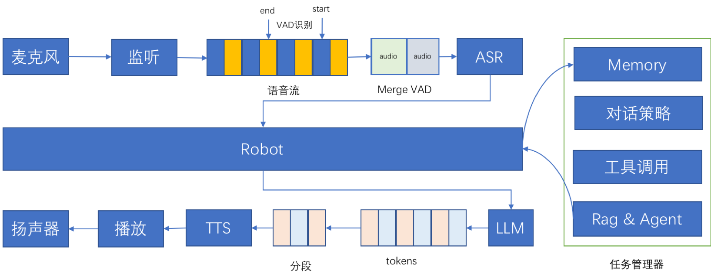

# 百聆 (Bailing)

<span>[ 中文 | <a href="README_en.md">English</a> ]</span>

**百聆** 是一个开源的语音对话助手，旨在通过语音与用户进行自然的对话。该项目结合了语音识别 (ASR)、语音活动检测 (VAD)、大语言模型 (LLM) 和语音合成 (TTS) 技术，这是一个类似GPT-4o的语音对话机器人，通过ASR+LLM+TTS实现，提供高质量的语音对话体验，端到端时延800ms。百聆旨在无需GPU的情况下，实现类GPT-4o的对话效果，适用于各种边缘设备和低资源环境。


## 项目特点

- 🚀 **流畅对话体验**：低延迟、不卡顿，几乎像真人对话一样自然，百聆使用了多个开源模型，确保高效、可靠的语音对话体验。
- 🖥 **轻量级部署**：无需高端硬件，甚至不需要 GPU，通过优化，可本地部署，仍能提供类GPT-4的性能表现。
- 🔧 **模块化设计**：ASR、VAD、LLM和TTS模块相互独立，可以根据需求进行替换和升级。
- 🧠 **智能记忆功能**：具备持续学习能力，能够记忆用户的偏好与历史对话，提供个性化的互动体验。
- 🛠 **工具调用能力**：灵活集成外部工具，用户可通过语音直接请求信息或执行操作，提升助手的实用性。  
- 📅 **任务管理**：高效管理用户任务，能够跟踪进度、设置提醒，并提供动态更新，确保用户不错过任何重要事项。 

## 感谢开源社区
百聆的诞生，离不开开源社区的无私贡献。

感谢 DeepSeek、FunASR、Silero-VAD、ChatTTS、OpenManus 等优秀的开源项目，
让我们有机会打造一个真正 开放、强大、低门槛 的语音 AI 助手！

如果你也认同 让 AI 触手可及 的理念，欢迎一起贡献代码、优化模型，
让百聆更强、更智能，成为真正的 JARVIS！

📢 欢迎 Star & PR


## 项目简介

百聆通过以下技术组件实现语音对话功能：

- 🎙 **ASR**: 使用 [FunASR](https://github.com/modelscope/FunASR) 进行自动语音识别，将用户的语音转换为文本。
- 🎚 **VAD**: 使用 [silero-vad](https://github.com/snakers4/silero-vad) 进行语音活动检测，以确保只处理有效的语音片段。
- 🧠 **LLM**: 使用 [deepseek](https://github.com/deepseek-ai/DeepSeek-LLM) 作为大语言模型来处理用户输入并生成响应，极具性价比。
- 🔊 **TTS**: 使用 [edge-tts](https://github.com/rany2/edge-tts) [Kokoro-82M](https://huggingface.co/hexgrad/Kokoro-82M) [ChatTTS](https://github.com/2noise/ChatTTS) MacOS say进行文本到语音的转换，将生成的文本响应转换为自然流畅的语音。


## 框架说明



Robot 负责高效的任务管理与记忆管理，能够智能地处理用户的打断请求，同时实现各个模块之间的无缝协调与连接，以确保流畅的交互体验。

| 播放器状态 | 是否说话 | 说明 |
|----------|----------|----------|
| 播放中 | 未说话 | 正常 |
| 播放中 | 说话 | 打断场景 |
| 未播放| 未说话 | 正常 |
| 未播放| 说话 | VAD判断，ASR识别 |

## Demo


[bailing audio dialogue](https://www.zhihu.com/zvideo/1818998325594177537)

[bailing audio dialogue](https://www.zhihu.com/zvideo/1818994917940260865)


## 功能特性

- **语音输入**：通过 FunASR 进行准确的语音识别。
- **语音活动检测**：使用 silero-vad 过滤无效音频，提升识别效率。
- **智能对话生成**：依靠 deepseek 提供的强大语言理解能力生成自然的文本回复，极具性价比。
- **语音输出**：通过 edge-tts Kokoro-82M 将文本转为语音，为用户提供逼真的听觉反馈。
- **支持打断**：灵活配置打断策略，能够识别关键字和语音打断，确保用户在对话中的即时反馈与控制，提高交互流畅度。
- **支持记忆功能**: 具备持续学习能力，能够记忆用户的偏好与历史对话，提供个性化的互动体验。
- **支持工具调用**: 灵活集成外部工具，用户可通过语音直接请求信息或执行操作，提升助手的实用性。
- **支持任务管理**: 高效管理用户任务，能够跟踪进度、设置提醒，并提供动态更新，确保用户不错过任何重要事项。

## 项目优势

- **高质量语音对话**：整合了优秀的ASR、LLM和TTS技术，确保语音对话的流畅性和准确性。
- **轻量化设计**：无需高性能硬件即可运行，适用于资源受限的环境。
- **完全开源**：百聆完全开源，鼓励社区贡献与二次开发。

## 安装与运行

### 依赖环境

请确保你的开发环境中安装了以下工具和库：

- Python 3.11 或更高版本
- `pip` 包管理器
- FunASR、silero-vad、deepseek、edge-tts Kokoro-82M 所需的依赖库

### 安装步骤

1. 克隆项目仓库：

    ```bash
    git clone https://github.com/wwbin2017/bailing.git
    cd bailing
    ```

2. 安装所需依赖：

    ```bash
    pip install -r requirements.txt
    pip install -r third_party/OpenManus/requirements.txt 
    ```

3. 配置环境变量：

     - 打开config/config.yaml 配置ASR LLM等相关配置
     - 下载SenseVoiceSmall到目录models/SenseVoiceSmall [SenseVoiceSmall下载地址](https://huggingface.co/FunAudioLLM/SenseVoiceSmall/tree/main)
     - 去deepseek官网，获取配置api_key，[deepseek获取api_key](https://platform.deepseek.com/api_keys)，当然也可以配置openai、qwen、gemini、01yi等其他模型
     - 如果需要使用通用AIGC配置（测试中），不可用的话，可以使用tag 分支 v0.0.1 v0.0.2 
       - /third_party/OpenManus/config/config.toml  需要配置里面的 model、base_url、api_key 
4. 运行项目：

    ```bash 
    cd server
    python server.py # 启动后端服务，也可不执行这一步
    ```
    
    ```bash
    python main.py
    ```

## 使用说明

1. 启动应用后，系统会等待语音输入。
2. 通过 FunASR 将用户语音转为文本。
3. silero-vad 进行语音活动检测，确保只处理有效语音。
4. deepseek 处理文本输入，并生成智能回复。
5. edge-tts, Kokoro-82M, ChatTTS, MacOs say 将生成的文本转换为语音，并播放给用户。


## Roadmap

- [x] 基本语音对话功能
- [x] 支持插件调用
- [x] 任务管理
- [x] Rag & Agent
- [x] Memory
- [ ] 支持语音唤醒
- [ ] 强化WebSearch
- [ ] 支持WebRTC

未来，百聆将升华为一款类JARVIS个人助手，仿佛一位贴心的智囊，具备无与伦比的记忆力与前瞻性的任务管理能力。依托于尖端的RAG与Agent技术，它将精确掌控您的事务与知识，化繁为简。只需轻声一语，例如“帮我查找最近新闻”或“总结大模型的最新进展”，百聆便会迅速响应，智能分析，实时跟踪，并将成果优雅地呈现给您。想象一下，您拥有的不仅是一名助手，而是一个深谙您需求的智慧伙伴，伴您在未来的每个重要瞬间，助您洞察万象，决胜千里。

## 支持的工具

| 函数名                       | 描述                 | 功能                              | 示例                                                         |
|---------------------------|--------------------|---------------------------------|--------------------------------------------------------------|
| `get_weather`             | 获取某个地点的天气信息        | 提供地点名称后，返回该地点的天气情况              | 用户说：“杭州天气怎么样？” → `zhejiang/hangzhou`             |
| `ielts_speaking_practice` | IELTS（雅思）口语练习      | 生成雅思口语练习题目和对话，帮助用户进行雅思口语练习      | -                                                            |
| `get_day_of_week`         | 获取当前的星期几或日期        | 当用户询问当前时间、日期或者星期几时，返回相应的信息      | 用户说：“今天星期几？” → 返回当前的星期几                    |
| `schedule_task`           | 创建一个定时任务           | 用户可以指定任务的执行时间和内容，定时提醒用户         | 用户说：“每天早上8点提醒我喝水。” → `time: '08:00', content: '提醒我喝水'` |
| `open_application`        | 在 Mac 电脑上打开指定的应用程序 | 用户可以指定应用程序的名称，脚本将在 Mac 上启动相应的应用 | 用户说：“打开Safari。” → `application_name: 'Safari'`        |
| `web_search`              | 在网上搜索指定的关键词        | 根据用户提供的搜索内容，返回相应的搜索结果           | 用户说：“搜索最新的科技新闻。” → `query: '最新的科技新闻'`    |
| `aigc_manus`              | 可以做任何事情通用型ai       | 要执行的任务描述，返回任务执行的结果。             | 用户说：“分析特定股票的市场趋势” → `query: '分析特定股票的市场趋势'`    |


## 贡献指南

欢迎任何形式的贡献！如果你对百聆项目有改进建议或发现问题，请通过 [GitHub Issues](https://github.com/wwbin2017/bailing/issues) 进行反馈或提交 Pull Request。

## 开源协议

该项目基于 [MIT 许可证](LICENSE) 开源。你可以自由地使用、修改和分发此项目，但需要保留原始许可证声明。

## 联系方式

如有任何疑问或建议，请联系：

- GitHub Issues: [项目问题追踪](https://github.com/wwbin2017/bailing/issues)

---

## 免责声明

百聆 (Bailing) 是一个开源项目，旨在用于个人学习和研究目的。使用本项目时，请注意以下免责声明：

1. **个人用途**：本项目仅用于个人学习和研究，不适用于商业用途或生产环境。
2. **风险和责任**：使用百聆 (Bailing) 可能会导致数据丢失、系统故障或其他问题。我们对因使用本项目而导致的任何损失、损害或问题不承担任何责任。
3. **支持**：本项目不提供任何形式的技术支持或保证。用户应自行承担使用本项目的风险。

在使用本项目之前，请确保您已了解并接受这些免责声明。如果您不同意这些条款，请不要使用本项目。

感谢您的理解与支持！

## Star History

[](https://star-history.com/#wwbin2017/bailing&Date)
