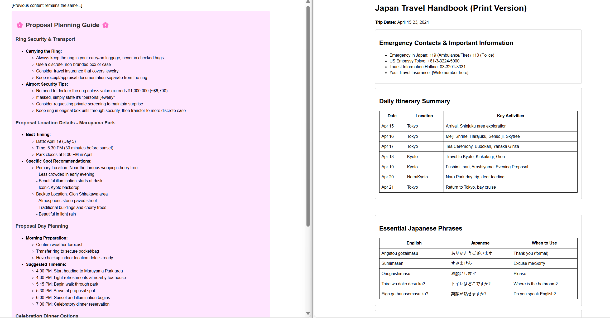
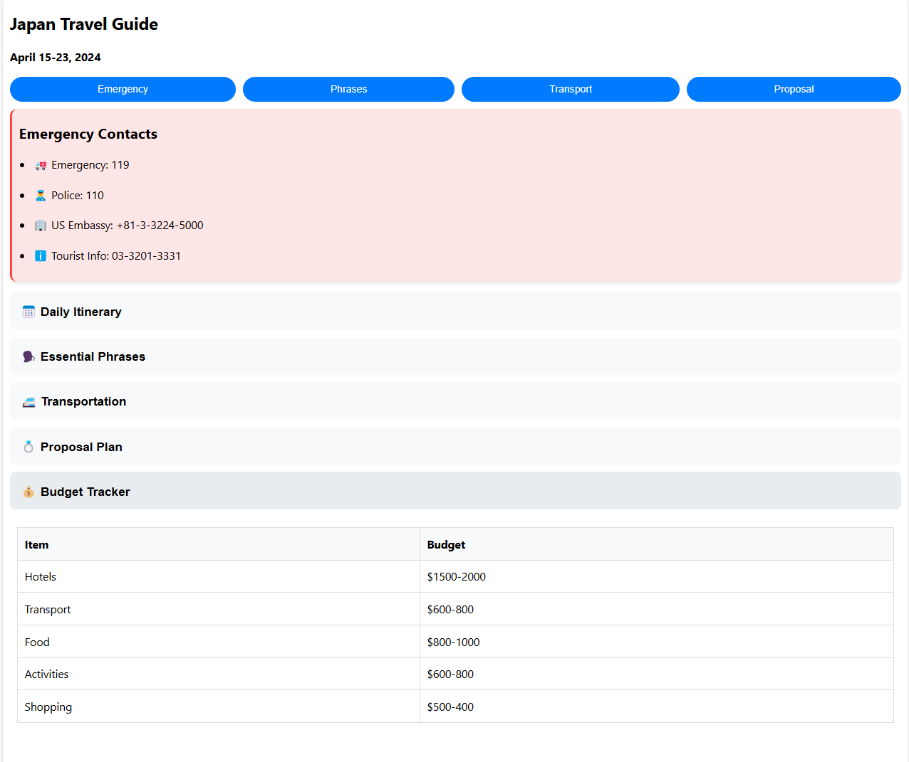

# Examples

We put some examples in the `examples` directory. All the examples use the same prompt
as [Manus](https://manus.im/?utm_source=ai-bot.cn).

The Model we use is `claude3.5`.

## Japan Travel Plan
**Prompt**：
```
I need a 7-day Japan itinerary for April 15-23 from Seattle, with a $2500-5000 budget for my fiancée and me. We love historical sites, hidden gems, and Japanese culture (kendo, tea ceremonies, Zen meditation). We want to see Nara's deer and explore cities on foot. I plan to propose during this trip and need a special location recommendation. Please provide a detailed itinerary and a simple HTML travel handbook with maps, attraction descriptions, essential Japanese phrases, and travel tips we can reference throughout our journey.
```
**preview**：



